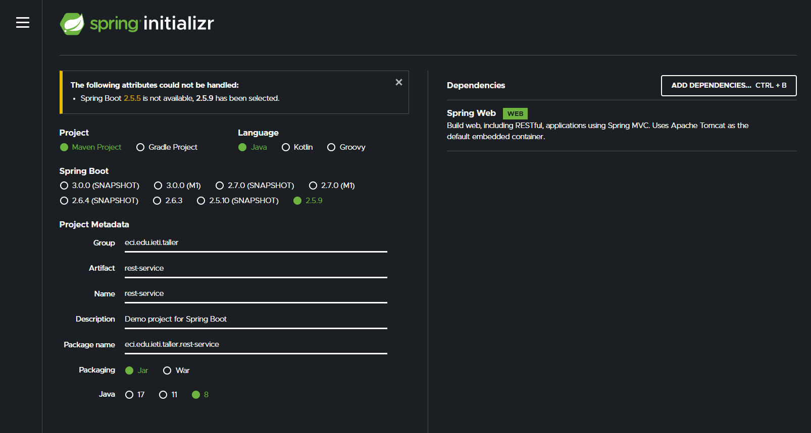
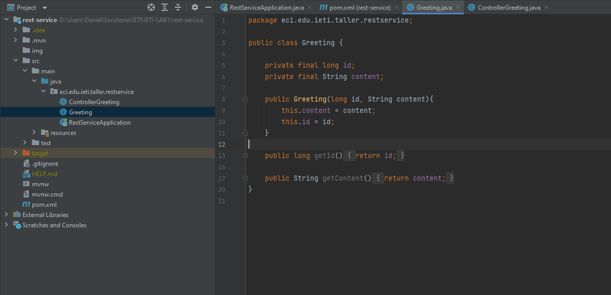
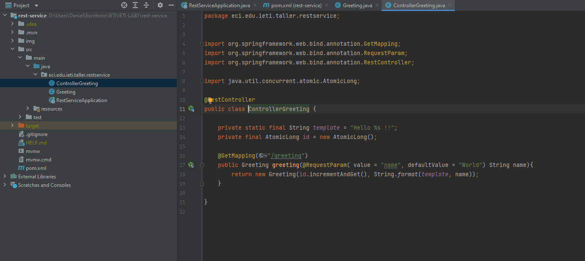
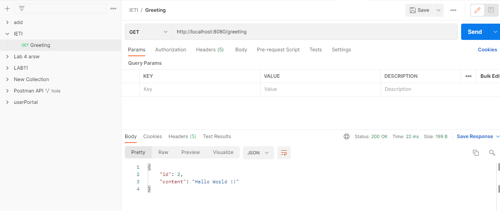
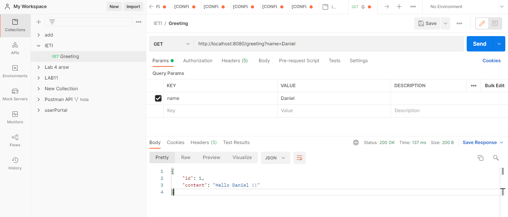

# Taller Greeting

Realizamos la inicialización del proyecto con [Spring initializr](https://start.spring.io)

Realizamos el código correspondiente creando la clase Greeting y el controlador de Greeting

Una vez realizado iniciamos el proyecto y testeamos lo realizado

